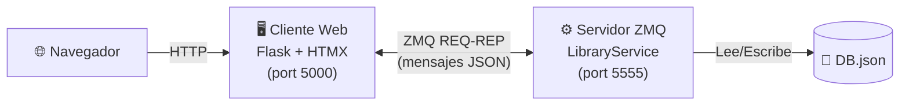

# RMI-Workshop — Sistema de Biblioteca ZeroMQ

Sistema de gestión de biblioteca implementado con **ZeroMQ** (comunicación cliente-servidor) y **Flask + HTMX** (interfaz web).

## Arquitectura



## Operaciones disponibles

| Operación | Acción ZMQ | Descripción |
|-----------|------------|-------------|
| Préstamo por ISBN | `loan_by_isbn` | Presta un libro buscándolo por su ISBN |
| Préstamo por Título | `loan_by_title` | Presta un libro buscándolo por título |
| Consulta por ISBN | `query_by_isbn` | Consulta la información de un libro |
| Devolución por ISBN | `return_by_isbn` | Devuelve un libro prestado |

## Requisitos

- Python 3.10+
- pip

## Instalación

```bash
pip install -r requirements.txt
```

## Ejecución

Se necesitan **dos terminales**:

### Terminal 1 — Servidor ZeroMQ
```bash
python -m server.main
```
El servidor escuchará en `tcp://*:5555`.

### Terminal 2 — Cliente Web
```bash
python -m client.app
```
Abrir el navegador en: [http://localhost:5000](http://localhost:5000)

## Protocolo de mensajes (JSON sobre ZMQ)

**Petición:**
```json
{
  "action": "loan_by_isbn",
  "isbn": "978-0-06-112008-4",
  "borrower": "Juan Pérez"
}
```

**Respuesta:**
```json
{
  "success": true,
  "message": "Préstamo exitoso: 'Cien años de soledad' prestado a Juan Pérez",
  "book": {
    "isbn": "978-0-06-112008-4",
    "title": "Cien años de soledad",
    "author": "Gabriel García Márquez",
    "year": 1967,
    "available": false,
    "borrower": "Juan Pérez"
  }
}
```

## Estructura del proyecto

```
RMI-Workshop/
├── README.md
├── requirements.txt
├── server/
│   ├── __init__.py
│   ├── main.py                # Arranque del servidor ZMQ
│   ├── library_service.py     # Servicio ZMQ (REP socket)
│   ├── db.py                  # Acceso a datos (DB.json)
│   └── DB.json                # Base de datos de libros
├── client/
│   ├── __init__.py
│   ├── app.py                 # App Flask
│   ├── grpc_client.py         # Cliente ZMQ (REQ socket)
│   ├── templates/
│   │   ├── base.html
│   │   ├── index.html
│   │   └── partials/
│   │       ├── loan_result.html
│   │       ├── query_result.html
│   │       └── return_result.html
│   └── static/
│       └── style.css
```

## Tecnologías

- **ZeroMQ (pyzmq)** — Comunicación cliente-servidor (patrón REQ-REP)
- **Flask** — Framework web del lado del cliente
- **HTMX** — Interactividad sin JavaScript manual
- **JSON** — Persistencia de datos y protocolo de mensajes


